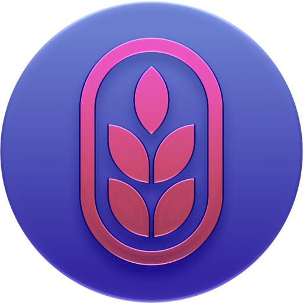
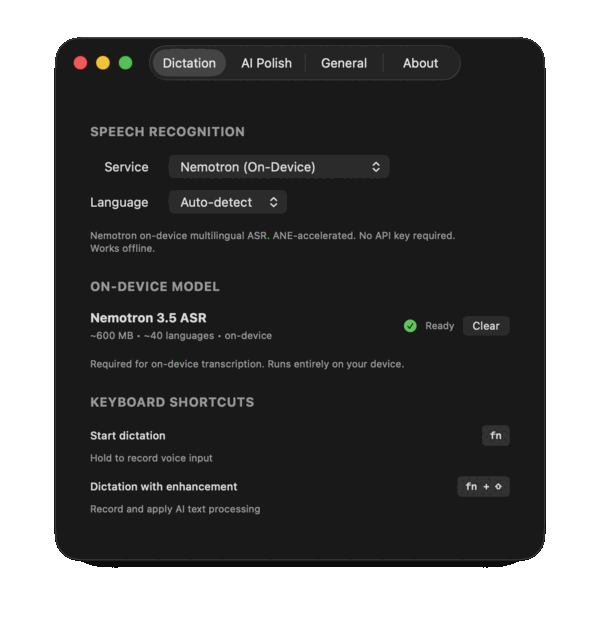
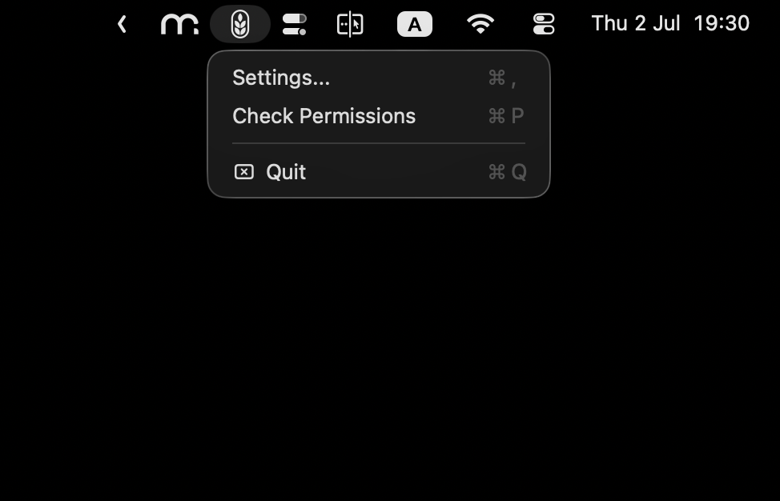

<div align="center">
  

# Omri

  **עמרי | om-REE** — harvesting voice into text
</div>

Native voice transcription for macOS and iOS. Use private on-device transcription with Nemotron or Apple SpeechAnalyzer, or bring your own Groq/OpenAI API key.

## Screenshots

<div align="center">
  

  *Settings — Dictation · AI Polish · General · About*

  <br>

  

  *Menu bar*
</div>

## Features

### macOS

- Hold `fn` → speak → release to paste text anywhere
- Hold `fn + shift` to apply AI polish
- Private on-device transcription with Nemotron 3.5 ASR
- Text is pasted after you release `fn`
- Apple SpeechAnalyzer support on macOS 26+
- Cloud transcription with Groq, OpenAI, or a custom OpenAI-compatible endpoint
- Menu bar app, no telemetry

### iOS

- SSH terminal with voice dictation
- Floating dictation controls
- On-device Nemotron transcription with live preview
- Cloud transcription with Groq, OpenAI, or custom endpoints
- Saved SSH connections with Keychain password storage
- Hack Nerd Font included for terminal prompts

## Quick Start

1. Download the latest release from [Releases](https://github.com/nasedkinpv/omri/releases).
2. Extract `Omri-vX.X.X-apple-silicon.zip`.
3. Remove quarantine:

   ```bash
   xattr -rd com.apple.quarantine Omri.app
   ```

4. Move `Omri.app` to Applications.
5. Launch Omri and grant microphone access.
6. Pick a transcription provider in Settings.

Hold ⌥Space to dictate. The hotkey needs no extra permission.

## Transcription Providers

- **Nemotron (On-Device)**: private, offline after model download, ~40 languages, no API key
- **Apple (On-Device)**: private native SpeechAnalyzer on macOS 26+
- **Groq/OpenAI**: cloud transcription with your own API key
- **Custom**: OpenAI-compatible transcription endpoint

## Requirements

### macOS

- macOS 26.0+
- Apple Silicon recommended for on-device Nemotron
- Microphone permission (required)
- Accessibility permission (optional) — auto-inserts the transcript into the active app; without it, the text is copied to the clipboard
- Input Monitoring (optional) — hold the fn key to dictate; the ⌥Space hotkey works without it

### iOS

- iOS 26.0+
- Microphone permission
- Internet only for cloud APIs or first on-device model download

## Build from Source

```bash
git clone https://github.com/nasedkinpv/omri.git
cd omri
open Omri.xcodeproj
```

Build schemes:

```bash
xcodebuild -project Omri.xcodeproj -scheme Omri -configuration Debug build
xcodebuild -project Omri.xcodeproj -scheme OmriiOS -sdk iphonesimulator build
```

## Privacy

- On-device audio never leaves your device.
- Cloud APIs are used only when you select a cloud provider.
- API keys and SSH passwords are stored in Keychain.
- No telemetry or tracking.
- Temporary audio files are deleted after processing.
- Accessibility permission (macOS) is used only to insert transcribed text at your cursor in the app you're using. Omri never reads screen contents; if declined, it falls back to copy and paste.

## License

MIT License — see [LICENSE](LICENSE).

On-device transcription uses the [NVIDIA Nemotron 3.5 ASR model](https://huggingface.co/nvidia/nemotron-3.5-asr-streaming-0.6b), Copyright © NVIDIA Corporation, licensed under [OpenMDW-1.1](https://openmdw.ai/license/1-1/). CoreML conversion and runtime by [FluidAudio](https://github.com/FluidInference/FluidAudio) (Apache-2.0).

Created by [Ben Nasedkin](https://github.com/nasedkinpv).
